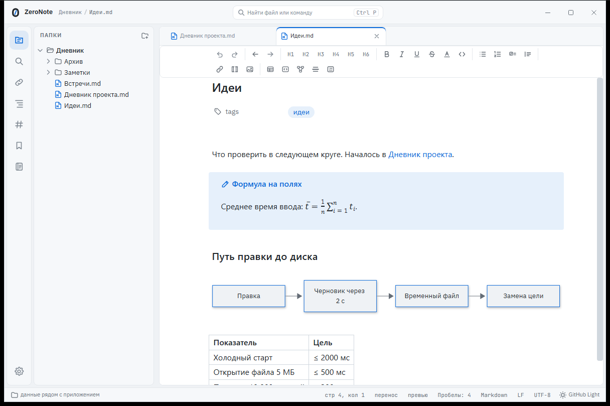
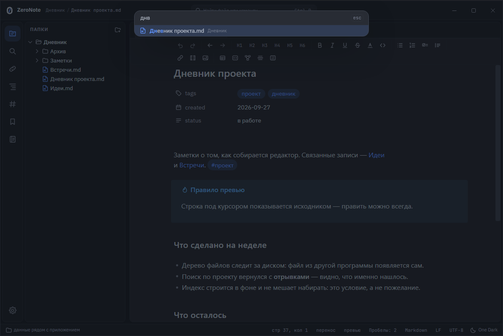
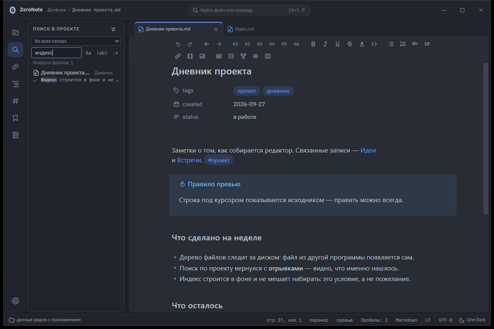
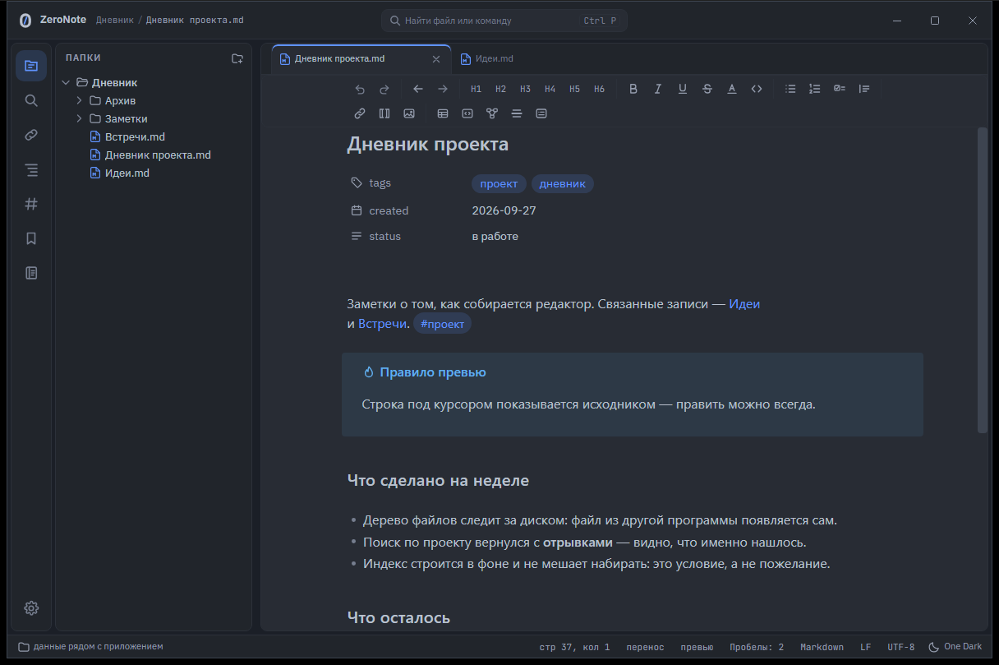

<div align="center">

<picture>
  <source media="(prefers-color-scheme: dark)" srcset="icons/zeronote-dark-128.png">
  
</picture>

# ZeroNote

**Редактор текста и заметок для Windows**<br>
открывается мгновенно, как Notepad++, а с папкой работает как с проектом

<a href="README.md"></a>
<a href="README.en.md"></a>

<a href="https://github.com/Mark-Karte/ZeroNote/releases/latest"></a>

<a href="LICENSE"></a>
<a href="https://github.com/Mark-Karte/ZeroNote/actions/workflows/ci.yml"></a>
<a href="https://github.com/Mark-Karte/ZeroNote/commits/main"></a>
<a href="https://github.com/Mark-Karte/ZeroNote/stargazers"></a>

<br>

<picture>
  <source media="(prefers-color-scheme: dark)" srcset="docs/screenshots/window-dark.png">
  
</picture>

<br>

<a href="https://github.com/Mark-Karte/ZeroNote/releases/latest"></a>

<sub>Windows 10 и 11, 64 бита · около 7 МБ · без прав администратора</sub>

</div>

С папкой ZeroNote работает как с проектом — деревом файлов, поиском
по содержимому и связями между заметками. Хранилище Obsidian открывается
обычной папкой: `[[ссылки]]`, теги и frontmatter ZeroNote понимает как
свойство markdown, а не как «режим совместимости». Свой формат проекта —
один файл `zeronote.toml`, и тот появляется только по вашей команде.

## Установка

1. Скачайте `ZeroNote_*_x64-setup.exe` со страницы
   [выпусков](https://github.com/Mark-Karte/ZeroNote/releases).
2. Запустите. Установка идёт в профиль пользователя — права администратора
   не нужны.

Нужны Windows 10 или 11 (64 бита) и WebView2 — он есть в Windows 11
из коробки, а в Windows 10 обычно приходит с Edge. Установщик весит около
7 МБ.

**Windows покажет синий экран SmartScreen** — «Windows защитила ваш
компьютер». Так бывает у любой программы без сертификата подписи; сертификат
стоит денег и в первом круге не планируется. Чтобы поставить: «Подробнее» →
«Выполнить в любом случае». Не доверяете — соберите из исходников, это две
команды, они ниже.

Обновления приложение проверяет **только по нажатию**: «Параметры → Сведения →
Обновления». Само в сеть оно не ходит никогда, фоновых проверок нет.

**В проводнике** после установки появляется «Открыть в ZeroNote» — и на файле,
и на папке, — а сам ZeroNote встаёт в список «Открыть с помощью» для заметок,
текста, данных и исходного кода — полусотни расширений от `.md` и `.json`
до `.py` и `.cpp`. Умолчание установщик не отнимает: чтобы `.md` открывался
двойным щелчком, назначьте ZeroNote сами — правой кнопкой по файлу, «Открыть
с помощью» → «Выбрать другое приложение», либо в параметрах Windows,
«Приложения по умолчанию». У назначенных типов в проводнике свой значок:
лист с полосой цвета вида файла и подписью типа.

На Windows 11 пункт «Открыть в ZeroNote» лежит под «Показать дополнительные
параметры» (то же меню открывается сразу по Shift+F10). Всё, что установщик
добавил в реестр, удаление снимает; папка `data` с настройками, темами
и сессией при удалении остаётся.

## Как это выглядит

Одно поле палитры на три режима: файлы по нечёткому совпадению, `>` команды,
`#` теги. `днв` находит «Дневник проекта».



Поиск по всему проекту — с отрывками, чтобы было видно, что именно нашлось.
Индекс строится в фоне и не мешает набирать текст.



Девять встроенных тем: One Dark, Dracula, Tokyo Night, GitHub Light, Solarized
Light, Catppuccin Latte, «Контраст» и пара Obsidian Dark и Obsidian Light.
Шесть первых — адаптации популярных тем под наш слой оформления, все под
лицензией MIT, ссылки на источники — в заголовках файлов тем. Пара Obsidian
повторяет вид стандартной темы Obsidian: цвета, шрифты и меры заметки.
Светлая и тёмная пара следуют настройке Windows — как этот README: вверху
окно в теме вашего GitHub, здесь — в другой.

<picture>
  <source media="(prefers-color-scheme: dark)" srcset="docs/screenshots/window-light.png">
  
</picture>

## Что умеет

### Папка как проект

- Папка открывается корнем (`Ctrl+Shift+O`), корни переживают перезапуск.
- Дерево файлов со слежением за диском: файл, созданный в другой программе,
  появляется сам. Создать, переименовать, удалить — **только в корзину**.
  Правила игнорирования — в семантике `.gitignore`, включая вложенные.
- Переименование заметки чинит ссылки на неё в других файлах. Список того,
  что будет изменено, показывается **до** правки, и от неё можно отказаться.
- Быстрое открытие по имени (`Ctrl+P`) с нечётким совпадением: `edtr` находит
  `EditorHost.svelte`. Находит и картинки с PDF, а не только текст.
- Поиск по содержимому (`Ctrl+Shift+F`) на SQLite FTS5: строится в фоне,
  отменяется, обновляется сам по изменениям на диске. Можно искать
  и регулярным выражением.
- Замена по всему проекту или по одной папке: список изменений показывается
  **до** записи, файл с несохранёнными правками не трогается, пять последних
  замен отменяются.
- Оглавление документа: заголовки списком, щелчок ведёт к разделу, раздел
  под курсором подсвечен.
- Панель тегов: какие теги есть в проекте и чем сколько помечено; щелчок
  показывает заметки с тегом.
- Связи между заметками: `[[ссылки]]`, теги, frontmatter, переход по `F12`
  и `Ctrl`+щелчку, панель обратных ссылок. Висячая ссылка видна, и `Ctrl`+щелчок
  по ней создаёт заметку там, куда ссылка и указывает.
- Ссылка ведёт и к разделу: `[[заметка#Раздел]]`, `[[#Раздел]]` — в этой же
  заметке, `[[заметка#^метка]]` — к метке блока; после `#` подсказка
  предлагает заголовки. Правила — те же, что у Obsidian.
- Вложения записью Obsidian: `![[рисунок.png]]` показывается картинкой,
  `[[рисунок.png]]` открывает её вкладкой.
- Снимок экрана из буфера (`Ctrl+V`) ложится файлом в папку вложений,
  а в текст — ссылка на него. Файл, брошенный из проводника на текст
  заметки, становится ссылкой в месте броска; файл не из проекта сначала
  копируется во вложения. Где папка вложений — настройкой, теми же
  значениями, что у Obsidian. Существующий файл не перезаписывается никогда.
- Хранилище Obsidian опознаётся, фильтры исключения переносятся в наш формат.
  В `.obsidian` не записывается ничего и никогда.

### Заметки

- Живое превью markdown: знаки разметки прячутся, а строка под курсором
  показывается как написана — править можно всегда. Файл при этом
  не меняется ни на байт; переключатель «превью / исходник» — в строке
  состояния.
- Заметка выглядит как в Obsidian: текст — пропорциональным шрифтом, код —
  моноширинным, коллауты — карточками цвета своего типа, списки —
  с направляющими вложенности, теги — плашками. Шрифт заметки
  настраивается отдельно от шрифта кода.
- Имя файла стоит заголовком над заметкой, и правка этого заголовка
  переименовывает файл — вместе со ссылками на него, как в дереве.
  Выключается настройкой.
- Свойства из frontmatter — карточкой: ключ, значение, теги плашками.
  Правятся исходником: щелчок по свойству ставит туда курсор.
- Таблицы сеткой, картинки в тексте, коллауты `> [!tip]` — список
  коллаутов свой: подпись, цвет и значок правятся. Задачи `- [ ]` отмечаются
  щелчком.
- Сноски `[^1]`, комментарии `%%…%%` — они видны в заметке и не идут
  в печать и экспорт, — квадратик цвета рядом с кодом `#rrggbb`.
- Формулы `$…$` и `$$…$$`, как в Obsidian. Рисует их движок окна шрифтом
  Cambria Math, который есть в каждой Windows.
- Схемы mermaid: блок ` ```mermaid ` показывается схемой в цветах темы.
- Дом для заметок — хранилище, которое открыто всегда, рядом с проектами
  и независимо от них: календарь ежедневных заметок, «Заметка на сегодня»,
  шаблоны с подстановкой `{{date}}`, `{{time}}`, `{{title}}`.
- Счётчик слов в строке состояния — у заметки и у выделения, знаки —
  в подсказке. Свойства в начале заметки не считаются.

### Наружу

- Печать, экспорт в PDF одной командой и экспорт в HTML одним файлом —
  стиль, картинки, формулы и схемы внутри, открывается в любом браузере.
- Копирование с оформлением — в письмо или Word: формулы становятся
  формулами Word, схемы — картинками.
- Бумага всегда светлая, даже если на экране тёмная тема.

### Редактор

- Вкладки с перетаскиванием, восстановление сессии после перезапуска —
  включая несохранённые вкладки без файла на диске.
- Области редактора, как в VS Code: `Ctrl+\` делит область, вкладки
  перетаскиваются между областями и на край области, один файл можно
  открыть в нескольких областях сразу, раскладка переживает перезапуск.
- Кодировки: UTF-8, UTF-16 LE/BE, windows-1251, windows-1252, IBM866, KOI8-R.
  Определяются сами, видны в строке состояния, меняются вручную — отдельно
  «интерпретировать как» и отдельно «преобразовать в».
- Переносы строк CRLF/LF/CR сохраняются как были. Отступы определяются
  по содержимому файла, а не по настройке.
- Подсветка синтаксиса на двадцати языках, включая код внутри блоков markdown.
- Панель инструментов над текстом, состав и порядок кнопок — настройкой.
  Разметка markdown **переключается**: нажатое второй раз снимается.
- Картинки и PDF открываются своей вкладкой, с масштабом и переходом
  по страницам.
- Поиск и замена, в том числе регулярными выражениями. Мультикурсор,
  свёртка блоков, парные скобки, закладки, невидимые символы.
- Назад и вперёд по местам курсора (`Alt+←`, `Alt+→`) — как в браузере,
  и стрелками в шапке. Закрытая по ошибке вкладка возвращается
  на `Ctrl+Shift+T` вместе с курсором, языком и закладками.
- Номера строк показываются только в коде: в заметке номер строки ничего
  не сообщает. Настройкой возвращаются куда угодно.
- Автосохранение — настройкой и по умолчанию выключенное: редактор файлов
  не пишет в чужой файл без команды. Черновики работают всегда.
- Контекстное меню везде — в тексте, на вкладке, в дереве, в поле ввода.
- Файлы свыше 50 МБ открываются только для чтения.

### Настройка

- Всё настраиваемое лежит в читаемых файлах: `settings.toml`, `keymap.toml`,
  темы. Окно параметров — надстройка над ними, а не наоборот: оно правит файл,
  сохраняя комментарии и порядок ключей.
- Горячие клавиши переназначаются во вкладке «Клавиши» окна параметров или
  прямо в файле. Раскладка выросла из Notepad++, новые сочетания берутся
  из VS Code.
- Тема выбирается во вкладке «Оформление» окна параметров — карточкой
  с образцом на настоящих цветах. Там же «создать свою на основе этой»,
  редактор цветов и размеров темы и шрифты интерфейса и текста. Сохранили
  файл темы — окно перерисовалось, перезапуск не нужен.
- Опечатка в файле настроек не отключает весь файл: незнакомое называется
  строкой вверху окна, всё остальное применяется.

## Чего нет и не будет в первом круге

Только Windows, только локальная файловая система. Вне области: синхронизация
и облако, Linux и Android, плагины, макросы, LSP и автодополнение, сравнение
файлов, FTP, совместное редактирование.

Пока нет, но обсуждается: граф связей, мини-карта.
Полный список — раздел «Отложено» в [DESIGN.md](DESIGN.md).

## Что внутри

Tauri v2, Rust, TypeScript и Svelte 5, CodeMirror 6, SQLite FTS5. Тяжёлая
работа — ввод-вывод, кодировки, обход дерева, индексация — на стороне Rust;
окно занимается отображением. PDF показывает pdf.js, формулы — Temml, схемы —
mermaid; все три грузятся, только когда понадобились, и на запуск не влияют.

Проект держится на шести инвариантах, и первый из них: **чужие файлы
неприкосновенны**. Открыли, сохранили — файл побайтово тот же: кодировка,
переносы строк, финальная пустая строка. Никакого автоформатирования без
явной команды.

Замысел, модель данных, инварианты, измерения и журнал решений —
в [DESIGN.md](DESIGN.md). Там же написано, почему каждое решение принято
именно так; это основной документ проекта, README — только вход.

## Сборка из исходников

Нужны Rust 1.88 или новее (msvc) и Node 20+.

```bash
npm install
npm run tauri build
```

Установщик появится в `src-tauri/target/release/bundle/nsis/`.
Отладочный запуск — `npm run tauri dev`.

Проверки:

```bash
npm run check
npm test
```

```bash
cd src-tauri && cargo test
```

Те же три проверки идут на каждое изменение в `main` и на каждый запрос
слияния — [.github/workflows/ci.yml](.github/workflows/ci.yml), на Windows.
Значок «проверки» вверху показывает состояние последнего прогона.

Замеры производительности — стенд встроен в приложение и включается
аргументами командной строки; цели и результаты в [DESIGN.md](DESIGN.md),
раздел «Измерения».

```bash
npm run tauri build
powershell -File bench\perf.ps1
```

## Если нашли проблему

Заводите [issue](https://github.com/Mark-Karte/ZeroNote/issues). К отчёту
полезно приложить версию Windows, версию ZeroNote (Параметры → Сведения →
Скопировать), что делали, что ожидали и что получилось. Для проблем
с открытием файла — его кодировку и тип переносов строк из строки состояния,
а лучше сам файл: угадать кодировку по описанию невозможно.

Важнее всего — нарушения инвариантов, и первое из них: **файл изменился сам**.
Открыли, ничего не правили, сохранили — и файл стал другим. Такое сообщение
разбирается раньше любого другого.

Если приложение ведёт себя странно после обновления, посмотрите на полосу
предупреждений вверху окна: туда попадают ошибки в `settings.toml`,
`keymap.toml` и файлах тем.

Как предложить правку в код или в перевод — в [CONTRIBUTING.md](CONTRIBUTING.md).

## Авторство

Mark Karte и Claude (Anthropic). Проект пишется в паре: архитектурные решения
и приёмка — за человеком, значительная часть кода и проектной документации —
за моделью. Журнал решений в [DESIGN.md](DESIGN.md) ведётся так, чтобы каждое
существенное решение можно было проследить и оспорить, кем бы оно ни было
предложено.

## Лицензия

MIT — см. [LICENSE](LICENSE). Правообладатель — Mark Karte.

Палитры шести встроенных тем адаптированы из популярных тем редакторов —
изменены светлота части цветов и раскладка ролей, оттенки оставлены. Все шесть
источников под лицензией MIT:

- **One Dark** — © 2016 GitHub Inc., [atom/one-dark-syntax](https://github.com/atom/one-dark-syntax)
- **Dracula** — © 2023 Dracula Theme, [dracula/dracula-theme](https://github.com/dracula/dracula-theme)
- **Tokyo Night** — © 2018–настоящее время Enkia, [enkia/tokyo-night-vscode-theme](https://github.com/enkia/tokyo-night-vscode-theme)
- **GitHub Light** — © 2020 Primer, [primer/github-vscode-theme](https://github.com/primer/github-vscode-theme)
- **Solarized Light** — © 2011 Ethan Schoonover, [altercation/solarized](https://github.com/altercation/solarized)
- **Catppuccin Latte** — © 2021 Catppuccin, [catppuccin/catppuccin](https://github.com/catppuccin/catppuccin)

Пара Obsidian Dark и Obsidian Light повторяет стандартную тему Obsidian
числами — цветами и размерами, которые Obsidian публикует в справке для
авторов тем; код его таблицы стилей не используется. Obsidian — товарный
знак Dynalist Inc.; ZeroNote с ним не связан.

Лицензия MIT для всех шести звучит так же, как наша: разрешено использовать,
копировать, изменять и распространять при условии, что уведомление
об авторских правах и текст разрешения приложены к копии. Ссылка на источник
и перечень изменений стоят в заголовке каждого файла темы; полные тексты
лицензий — в перечисленных репозиториях.

Вместе с приложением распространяются два шрифта под SIL Open Font License 1.1:
**IBM Plex Sans** (© 2017 IBM Corp.) и **JetBrains Mono**
(© 2020 The JetBrains Mono Project Authors). Файлы и тексты лицензий —
в [src/theme/fonts/](src/theme/fonts/). На остальной код и документацию
это не влияет: OFL распространяется на сами шрифты.

В окно приложения собраны библиотеки под открытыми лицензиями. Крупнейшие:
**pdf.js** (Apache-2.0, © Mozilla Foundation), **Temml** (MIT, © 2020 Ron Kok),
**mermaid** (MIT, © Knut Sveidqvist) со своими зависимостями — они под MIT,
ISC, BSD-3-Clause и Apache-2.0, движок раскладки **elkjs** под EPL-2.0
(исходники — [eclipse/elk](https://github.com/eclipse/elk) и
[kieler/elkjs](https://github.com/kieler/elkjs)), **DOMPurify** под MPL-2.0
или Apache-2.0 на выбор. **Все сторонние компоненты — шрифты, палитры тем,
91 библиотека окна и 210 крейтов ядра — с текстами их лицензий перечислены
в [THIRD-PARTY-NOTICES.md](THIRD-PARTY-NOTICES.md).** Этот же файл
установщик кладёт рядом с программой; в самом ZeroNote он открывается
из «Параметры → Сведения → Лицензии».

**Шрифт Temml с приложением не поставляется.** В самом файле
`Temml.woff2` записан запрет коммерческого использования, а проект под MIT.
Формулы рисует системный шрифт Cambria Math; из-за этого буквы
`\mathscr` выглядят так же, как `\mathcal`.
