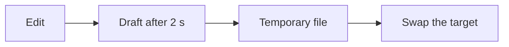

What to check in the next round. Started in [[Project journal]].

> [!note] A formula in the margin
> Mean typing time: $\bar t = \frac{1}{n}\sum_{i=1}^{n} t_i$.

## How an edit reaches the disk

| Measure | Target |
|---|---|
| Cold start | ≤ 2000 ms |
| Opening a 5 MB file | ≤ 500 ms |
| Folder with 10,000 entries | ≤ 300 ms |
