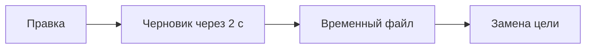

Что проверить в следующем круге. Началось в [[Дневник проекта]].

> [!note] Формула на полях
> Среднее время ввода: $\bar t = \frac{1}{n}\sum_{i=1}^{n} t_i$.

## Путь правки до диска

| Показатель | Цель |
|---|---|
| Холодный старт | ≤ 2000 мс |
| Открытие файла 5 МБ | ≤ 500 мс |
| Папка на 10 000 записей | ≤ 300 мс |
